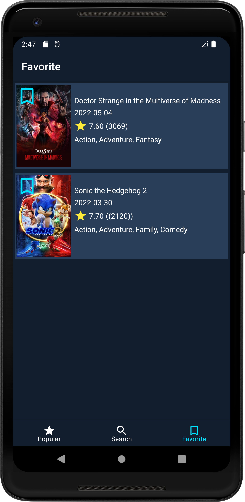
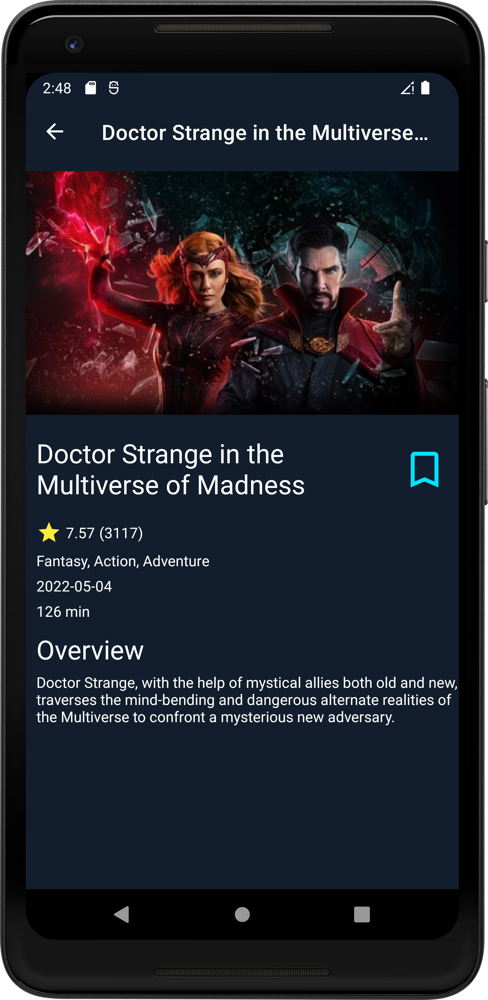

<h1 align="center">MovieApp</h1>

MovieApp is Android project using The Movie DB API and MVVM architecture.

## Tech Stack
* REST API - Retrofit
* Dependency injection - Hilt
* Database - Room
* Pagination - Paging  3
* Key-value pair data storage - Preferences DataStore
*  Kotlin Coroutines
* Kotlin Flow
* Navigation Component
* View Binding
* Glide
